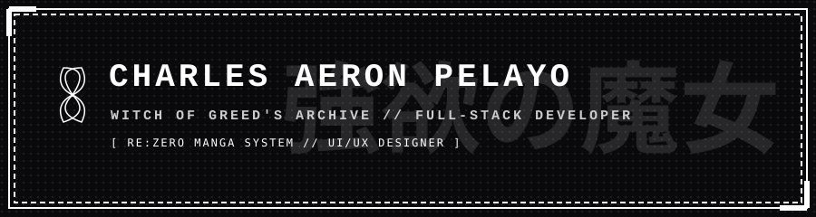

  

   
   

  

   

  
  
  
  

 

## [ CHAPTER 01 : THE SANCTUARY ]

  

 

> *"I am the Witch of Greed, Echidna. Knowledge... Yes, I seek all knowledge in this world. Unsatisfied with any outcome, pursuing perfection through infinite trials."*

Welcome to the Sanctuary. As a **Full-Stack Developer** and **UI/UX Enthusiast**, I approach software engineering with an unquenchable thirst for learning and refinement. Just like infinite iterations of a trial, debugging and crafting seamless user experiences is a continuous journey toward perfection.

- **Design Architecture**: Crafting structured, accessible visual systems and component libraries.
- **Full-Stack Mastery**: Architecting scalable web applications using Laravel, Vue.js, React, and TypeScript.
- **Uncompromising Quality**: Clean code, modular patterns, and constant optimization.

 

## [ CHAPTER 02 : GRIMOIRE OF KNOWLEDGE ]

  ### PANEL A // FRONTEND & UI
  

    
    
    
    
    
    
    
    
    
    
    
    
  

   

  ### PANEL B // BACKEND & INFRA
  

    
    
    
    
    
    
    
    
    
    
    
    
  

   

  

 

## [ CHAPTER 03 : TRIAL RECORDS & ANALYTICS ]

  

    
  

  

    
  

  
   
  
  

 

## [ CHAPTER 04 : THE TEA PARTY ]

  You are invited to the Tea Party. Open for engineering collaborations, design consultations, and full-stack projects.

   
   

  
  

   
   

  

   
   

  

