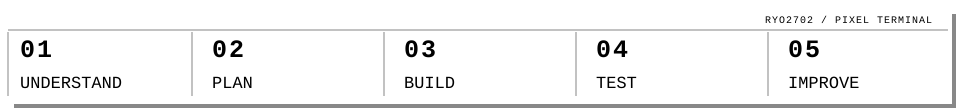

<!-- Artwork: python3 scripts/render_profile.py -->

  

# CHARLES AERON L. PELAYO

**FREELANCE WEB DEVELOPER**

Practical systems. Responsive interfaces. Maintainable code.

> I build practical, responsive, maintainable websites that help businesses improve their online presence.

| STATUS | FOCUS | LOCATION |
| :--- | :--- | :--- |
| Available for freelance projects | Web Development / WordPress / SEO | Philippines |

---

## ABOUT

I build reliable web applications and websites around real business needs. My work focuses on clear interfaces, readable code, reusable components, maintainable architecture, and solid foundations for performance, user experience, and SEO.

  

**UNDERSTAND → PLAN → BUILD → TEST → IMPROVE**

---

## SERVICES

### 01 / WEB DEVELOPMENT

Custom responsive websites and web applications built around real business requirements.

### 02 / WORDPRESS

WordPress websites, redesigns, maintenance, troubleshooting, performance improvements, and content implementation. WordPress is an area where I am actively expanding my practical experience.

### 03 / SEO

Technical and on-page SEO foundations, including:

- Semantic HTML
- Metadata
- Heading structure
- Internal linking
- Image optimization and alt text
- Sitemap foundations
- Performance and crawlability
- Structured content

---

## TECH STACK

| AREA | TECHNOLOGIES |
| :--- | :--- |
| **FRONTEND** | React · TypeScript · JavaScript · Vue · Tailwind CSS DaisyUI · shadcn/ui |
| **BACKEND** | Laravel · PHP · Node.js · Express |
| **DATABASE** | MySQL · MariaDB · PostgreSQL · SQLite |
| **TOOLS** | Git · GitHub · Linux · Vite · WordPress · Vercel · Hostinger |

---

## FEATURED PROJECTS

### 01 / DOCUMENT TRACKING MANAGEMENT SYSTEM

| | |
| :--- | :--- |
| **TYPE** | Municipal document workflow and tracking system |
| **STACK** | Laravel / PHP / MySQL / Tailwind / DaisyUI |
| **STATUS** | Completed |

A Laravel-based system created for municipal office processes.

- Document creation, forwarding, review, approval, and rejection
- Deadline tracking and QR-based document tracking
- Reporting, audit logs, archiving, and role-based access

### 02 / HR PROFILING & ORGANIZATIONAL MANAGEMENT SYSTEM

| | |
| :--- | :--- |
| **TYPE** | Internal HR and organizational platform |
| **STACK** | Laravel / Vue / MySQL |
| **STATUS** | Completed project |

An internal platform for organizing HR records and institutional structure.

- Departments, positions, and employee profiles
- Salary grades, plantilla positions, and position history
- Reporting and role-based access

### 03 / STOCKPILOT AI

| | |
| :--- | :--- |
| **TYPE** | Inventory operations platform concept |
| **STACK** | React / TypeScript / Laravel / PostgreSQL |
| **STATUS** | Concept / active exploration |

An inventory and operations platform concept focused on stock visibility and operational decision-making.

- Inventory monitoring and low-stock alerts
- Sales imports and CSV processing
- Reporting and anomaly detection concepts
- Restock recommendations

### 04 / SALESFORCE CRM CAPSTONE

| | |
| :--- | :--- |
| **TYPE** | CRM implementation project |
| **STACK** | Salesforce / Apex / Automation |
| **STATUS** | Capstone project |

A CRM capstone involving customer management, orders, inventory, automation flows, scheduled processes, reports, dashboards, and security configuration. This represents project-based implementation work, not a claim of production usage.

---

## DEVELOPMENT PRINCIPLES

1. Solve the actual problem.
2. Keep the interface understandable.
3. Write code another developer can maintain.
4. Prefer reusable systems over repeated code.
5. Optimize only when there is something worth optimizing.
6. Use AI as a development tool, not a substitute for understanding.

---

## CURRENTLY EXPLORING

1. Advanced Laravel architecture
2. React + TypeScript application architecture
3. WordPress development
4. Technical SEO
5. Performance optimization
6. AI-assisted development workflows

---

## CONTACT

| | |
| :--- | :--- |
| **EMAIL** | charlespelayo27@gmail.com |
| **PORTFOLIO** | charlesaeron-fullstack.vercel.app |
| **GITHUB** | github.com/Ryo2702 |

- [Email](mailto:charlespelayo27@gmail.com)
- [Portfolio](https://charlesaeron-fullstack.vercel.app)
- [GitHub](https://github.com/Ryo2702)
- [LinkedIn](https://www.linkedin.com/in/charles-aeron-pelayo-b9410a286/)

> Available for freelance web development projects.

---

  <strong>CHARLES AERON L. PELAYO</strong> 
  <code>WEB DEVELOPER / 2026</code>

