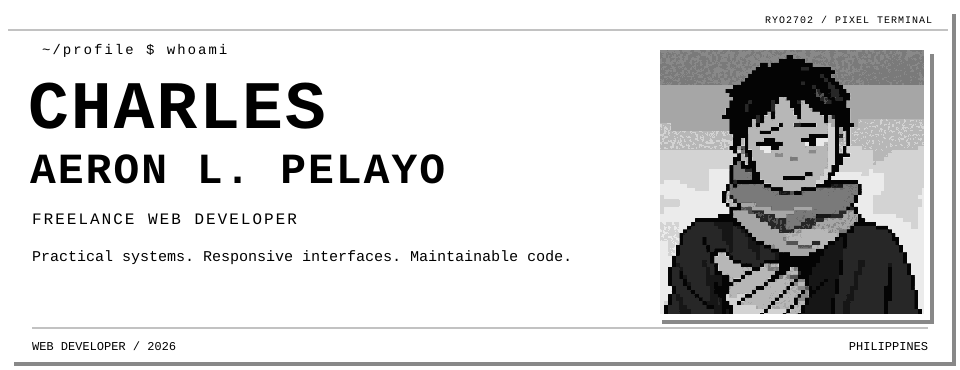
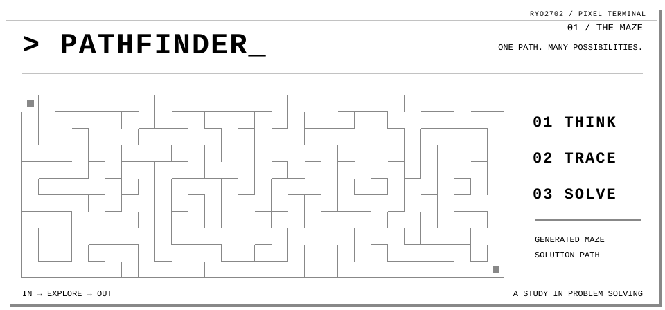
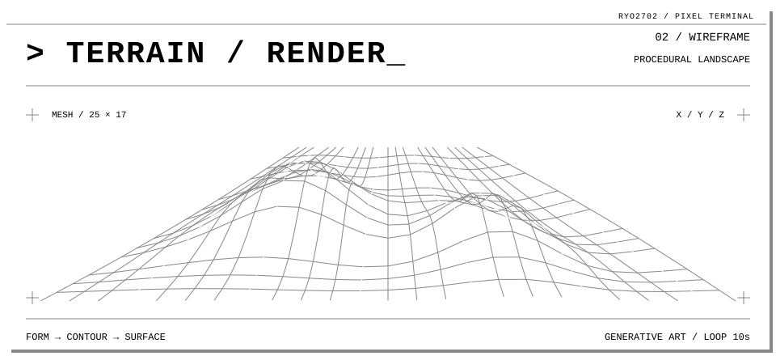

<!-- Artwork: python3 scripts/render_profile.py -->

  

  <a href="#about"><code>01 ABOUT</code></a> ·
  <a href="#services"><code>02 SERVICES</code></a> ·
  <a href="#tech-stack"><code>03 TECH STACK</code></a> ·
  <a href="#terminal-studies"><code>04 TERMINAL STUDIES</code></a>

# `CHARLES AERON L. PELAYO`

**`FREELANCE WEB DEVELOPER`**

Practical systems. Responsive interfaces. Maintainable code.

> I build practical, responsive, maintainable websites that help businesses improve their online presence.

| PROFILE | DETAILS |
| :--- | :--- |
| `STATUS` | Available for freelance projects |
| `FOCUS` | Web Development / WordPress / SEO |
| `LOCATION` | Philippines |

---

## `01 // ABOUT`

I build reliable web applications and websites around real business needs. My work focuses on clear interfaces, readable code, reusable components, maintainable architecture, and solid foundations for performance, user experience, and SEO.

`UNDERSTAND → PLAN → BUILD → TEST → IMPROVE`

---

## `02 // SERVICES`

### `01 / WEB DEVELOPMENT`

Custom responsive websites and web applications built around real business requirements.

### `02 / WORDPRESS`

WordPress websites, redesigns, maintenance, troubleshooting, performance improvements, and content implementation. WordPress is an area where I am actively expanding my practical experience.

### `03 / SEO`

Technical and on-page SEO foundations, including:

- Semantic HTML
- Metadata
- Heading structure
- Internal linking
- Image optimization and alt text
- Sitemap foundations
- Performance and crawlability
- Structured content

---

## `03 // TECH STACK`

| AREA | TECHNOLOGIES |
| :--- | :--- |
| `FRONTEND` | `React` · `TypeScript` · `JavaScript` · `Vue` · `Tailwind CSS` `DaisyUI` · `shadcn/ui` |
| `BACKEND` | `Laravel` · `PHP` · `Node.js` · `Express` |
| `DATABASE` | `MySQL` · `MariaDB` · `PostgreSQL` · `SQLite` |
| `TOOLS` | `Git` · `GitHub` · `Linux` · `Vite` · `WordPress` · `Vercel` · `Hostinger` |

---

## `04 // TERMINAL STUDIES`

  

  

